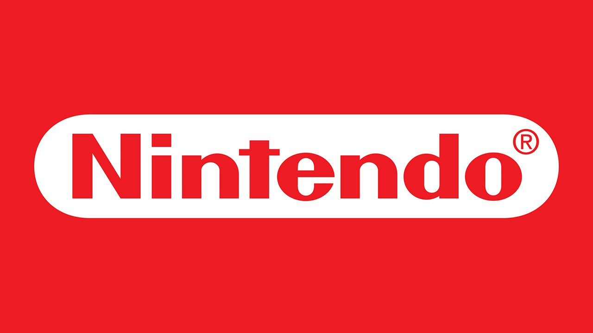

# HISTORIA

Una videoconsola o consola de videojuegos es un sistema electrónico de entretenimiento para el hogar que ejecuta videojuegos contenidos en cartuchos, discos ópticos, discos magnéticos, tarjetas de memoria o cualquier dispositivo de almacenamiento.

Los primeros sistemas de videoconsolas fueron diseñados únicamente para jugar videojuegos pero a partir de la quinta generación de videoconsolas han sido incorporadas características importantes de multimedia, internet, tiendas virtuales, servicio en línea como: Nintendo Network, PlayStation Network, y Xbox Live.

# [Sony PlayStation](sony.md)   
{: style="width:250px"}    
# [Nintendo](nintendo.md)
{: style="width:250px"}
# [Microsoft](microsoft.md)
{: style="width:200px"}