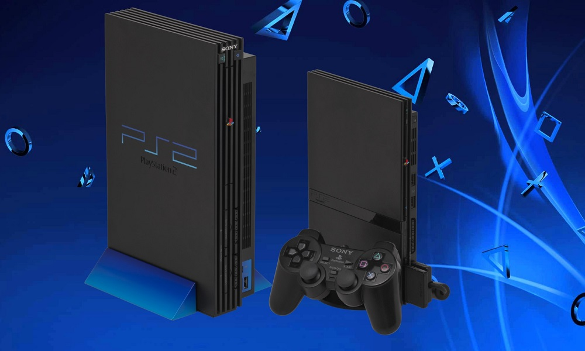
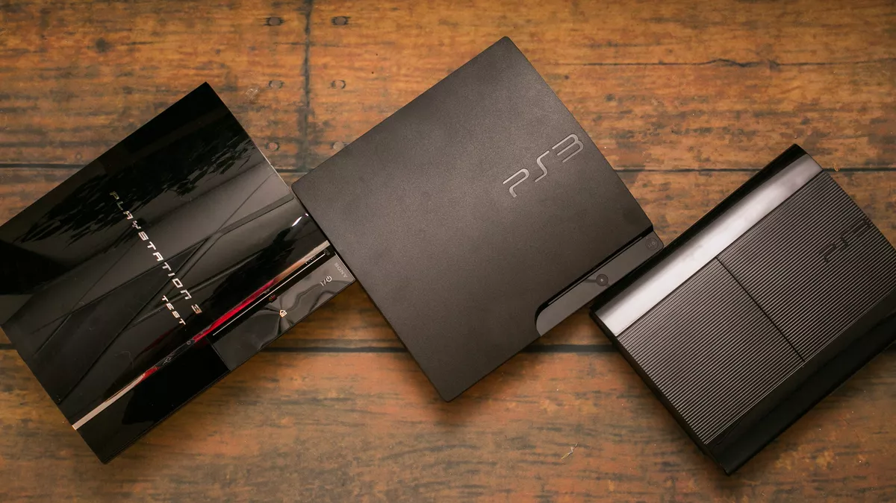
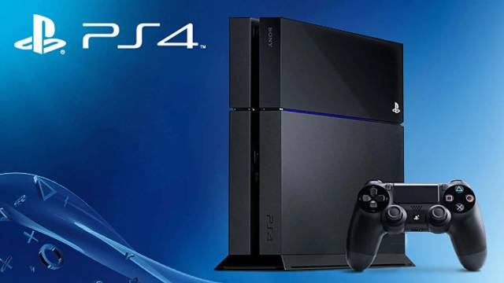
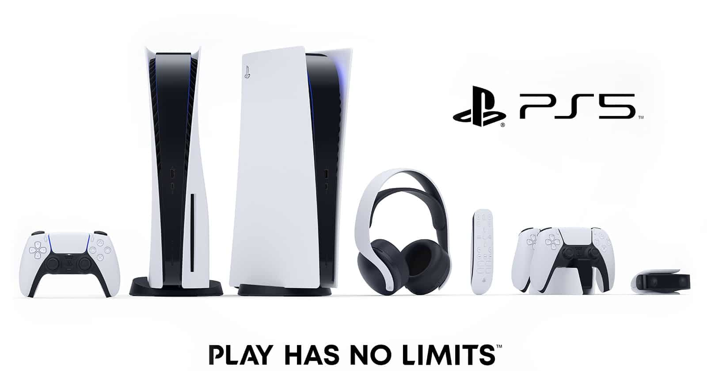

# SONY

 

## Play Station 1

La PlayStation Classic es una consola dedicada de videojuegos de la empresa Sony que emula los videojuegos lanzados originalmente en su consola original, la PlayStation (1994-2006). El dispositivo fue anunciado de manera oficial en septiembre de 2018, durante el transcurso de la Tokyo Game Show.1​ El lanzamiento internacional se produjo el 3 de diciembre de 2018, coincidiendo con el 24º aniversario del lanzamiento de la consola original 

 

## Play Station 2

PlayStation 2 es el sucesor de PlayStation (PS1), y compite contra la consola Dreamcast de Sega, la consola Nintendo GameCube de Nintendo y el sistema Xbox de Microsoft. También compite contra el sistema Windows XP del mismo fabricante que el sistema Xbox. A pesar del lanzamiento de su sucesora, PlayStation 3, en 2006, la consola siguió en el mercado y con un importante número de usuarios, compitiendo con las consolas de la séptima generación, siendo la única consola que ha logrado tener un ciclo de vida tan largo que compite con la generación posterior a la suya. videoconsola de sobremesa más vendida de la historia.

La PlayStation 2 es un sistema de entretenimiento aún disponible económicamente para las personas que les gustan los videojuegos, la cual alberga una gran variedad de géneros en sus juegos para todas las edades. 
***

## Play Station 3

La PlayStation 3 fue lanzada al mercado el 11 de noviembre de 2006 en Japón, el 17 de noviembre de 2006 en Norteamérica y el 23 de marzo de 2007 en Europa y Australia. Dos variantes estaban disponibles en el momento del lanzamiento: un modelo básico con 20 GB de disco duro SATA 2,5" y un modelo profesional con disco duro de 60 GB y varias características adicionales como doble número de puertos USB y retrocompatibilidad con juegos de su antecesora PlayStation 2 y Playstation 1. El modelo de 20 GB no fue comercializado en Europa y Australia, en su lugar se lanzó el modelo de 40 GB, que fue el que se extendió, ya que eliminaba la retrocompatibilidad, pero abarataba los costes. Desde entonces, a todos los modelos se le han hecho varias revisiones en su hardware para la disminución de su costo de producción y su precio de venta.

## Play Station 4

PlayStation 4 (プレイステーション4 Pureisutēshon Fō?, oficialmente abreviada como PS4) es la cuarta videoconsola del modelo PlayStation.8​ Es la segunda consola de Sony en ser diseñada por Mark Cerny y forma parte de las videoconsolas de octava generación. Fue anunciada oficialmente el 20 de febrero de 2013 en el evento PlayStation Meeting 2013,9​ aunque el diseño de la consola no fue presentado hasta el 10 de junio en el E3 2013.10​ Es la sucesora de la PlayStation 3 y compite con Wii U y Switch de Nintendo y Xbox One de Microsoft. Su lanzamiento fue el 15 de noviembre de 2013 en Estados Unidos y en Europa y Sudamérica fue el 29 de noviembre de 2013,11​9​ mientras que en Japón fue el 22 de febrero de 2014.2​

Alejándose de la compleja arquitectura utilizada en el procesador Cell de la videoconsola PlayStation 3, la PlayStation 4 cuenta con un procesador AMD de 8 núcleos bajo la arquitectura x86-64. Estas instrucciones x86-64 están diseñados para hacer más fácil el desarrollo de videojuegos en la consola de nueva generación, que atrae a un mayor número de desarrolladores. Estos cambios ponen de manifiesto el esfuerzo de Sony para mejorar las lecciones aprendidas durante el desarrollo, la producción y el lanzamiento de la PS3. Otras características de hardware notables de la PS4 es que incluyen 8 GB de memoria unificada GDDR5, una unidad de disco Blu-ray más rápido, y los chips personalizados dedicados a tareas de procesamiento de audio, vídeo y de fondo. 

## Play Station 5

PlayStation 5 (プレイステーション 5 Pureisutēshon Faibu?, abreviada como PS5) es una consola de videojuegos de sobremesa desarrollada por Sony Interactive Entertainment. Es la sucesora de la PlayStation 4, y se lanzó el 12 de noviembre de 2020 en Norteamérica, Japón, Australasia y Corea del Sur, mientras que fue lanzada el 19 de noviembre de 2020 en el resto del mundo.

Es la quinta consola de sobremesa de la marca PlayStation y la tercera en ser diseñada por Mark Cerny. A partir de su lanzamiento la consola contará con dos modelos: una consola PlayStation 5 con lector de discos BD UHD y una versión digital llamada, PlayStation 5 Digital Edition sin el lector.

La consola PS5 compite contra las consolas Xbox Series X|S de Microsoft y Switch de Nintendo para abrir paso a la novena generación de videojuegos.

La PlayStation 5 utiliza el mismo tipo de CPU de la marca AMD que la PlayStation 4, pero introduce una unidad de estado sólido (SSD) personalizada diseñada para la transmisión de datos de alta velocidad que permiten mejoras significativas en el rendimiento gráfico. El hardware también incluye una GPU AMD personalizada que posibilita la renderización por trazado de rayos, soporte para pantallas de resolución 4K y una alta tasa de fotogramas por segundo, efectos de audio 3D en tiempo real y retrocompatibilidad con la mayoría de los videojuegos para PlayStation 4 y PlayStation VR. 

